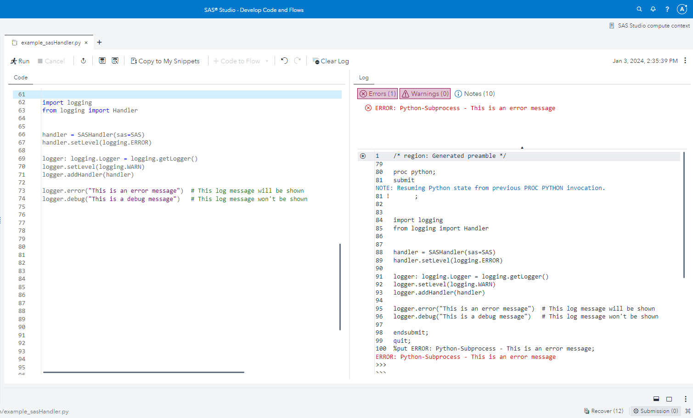

***
                            SAS Python Logger Handler
    

                                    Ene 2023
                            Alfredo Lorie Bernardo				

                                 version 0.1.0

***

# Introduction

The SASHandler allows to send python logging streams to SAS System logger when using the [SAS PROC PYTHON](https://go.documentation.sas.com/doc/en/pgmsascdc/default/proc/p0sj9pq2ryjlphn1ceq7ntpc1ipp.htm).

The [SAS PROC PYTHON](https://go.documentation.sas.com/doc/en/pgmsascdc/default/proc/p0sj9pq2ryjlphn1ceq7ntpc1ipp.htm) procedure enables you to run statements from the Python programming language within SAS code. 
You can submit Python statements from an external Python script or enter Python statements directly.  

# Download

GitHub: <https://github.com/a24lorie/sas-pylogger-handler>

# Using SASHandler
   
``` python
import logging
from logging import Handler

import saspy.SASsession as SAS 

handler = SASHandler(sas=SAS)
handler.setLevel(logging.ERROR)

logger: logging.Logger = logging.getLogger()
logger.setLevel(logging.WARN)
logger.addHandler(handler)

logger.error("This is an error message")  # This log message will be shown
logger.debug("This is a debug message")   # This log message won't be shown
```

# Contributing
This library welcomes contributors from all developers, regardless of your experience or programming background.
If you find a bug, send a [pull request](https://github.com/a24lorie/PyACL/pulls) and we'll discuss things. If you are not familiar with "***pull request***" term I recommend reading the following [article](https://yangsu.github.io/pull-request-tutorial/) for better understanding
We value kind communication and building a productive, friendly environment for maximum collaboration and fun.
